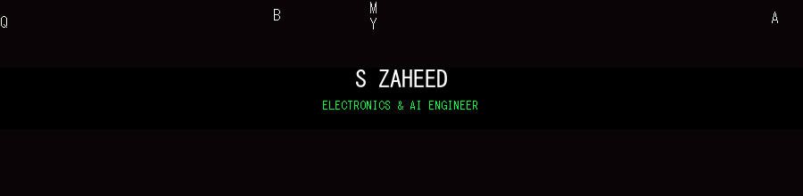

<p align="center">
  
</p>

<h1 align="center">
  
</h1>

<p align="center">
  
  
  
</p>

<p align="center">
  <a href="https://github.com/zaheeds017">
    
  </a>
  <a href="https://www.linkedin.com/in/shaik-zaheed-81802427a">
    
  </a>
  <a href="mailto:zaheeds2003e@gmail.com">
    
  </a>
</p>

---

## 👤 About Me

<p align="center">
  
</p>

```
> wake up, Zaheed... follow the white rabbit 🐇
```

I'm an **Electronics & Communication Engineering (ECE)** student at **Vemu Institute of Technology, P.Kothakota**, blending hardware and software in the real world of the Matrix.

- 🔌 **PCB Designing** — schematics, layouts, routing, manufacturing files
- 📡 **IoT** — embedded sensors, microcontrollers, connectivity
- 🧮 **MATLAB** — signal processing & simulation
- 🐍 **Python** — scripting, automation, AI/ML
- 📊 **MS Office** — documentation & presentations

---

## 🛠️ Tech Stack

<p align="center">
  
</p>

<p align="center">
  
  
  
  
</p>

---

## 📊 The Matrix — My GitHub Stats

<p align="center">
  
  
</p>

<p align="center">
  
</p>

<p align="center">
  
</p>

---

## 📈 Contribution Matrix

<p align="center">
  
</p>

---

## 🚀 Featured Projects

| Project | Description | Stack |
|---|---|---|
| [Omni AI Chatbot](https://github.com/zaheeds017/AI_Chatbot) | ChatGPT/Gemini-style Streamlit chatbot with offline calculators, TF-IDF knowledge base & streaming Gemini/OpenAI/Claude | Python, Streamlit |
| [MediAssist AI](https://github.com/zaheeds017/Medical_Assistant) | Educational Flask health-information assistant with optional LLM chat | Python, Flask |
| [Gen AI Workshop](https://github.com/zaheeds017/Gen_AI) | 10-module AI upskilling program — 30+ hands-on projects (ML → NLP → Gen AI → Agents) | Python, ML, Gen AI |

---

## 📫 Let's Connect

<p align="center">
  <a href="https://github.com/zaheeds017"></a>
  <a href="https://www.linkedin.com/in/shaik-zaheed-81802427a"></a>
  <a href="mailto:zaheeds2003e@gmail.com"></a>
</p>

<p align="center">
  📍 Hanumepalle, Venkatagirikota, Chittoor - 517424 · 📞 +91 93923 62646
</p>

---

<p align="center">
  
</p>

<p align="center">
  <sub>🐇 Take the red pill, enter the Matrix, and start building.</sub>
</p>
